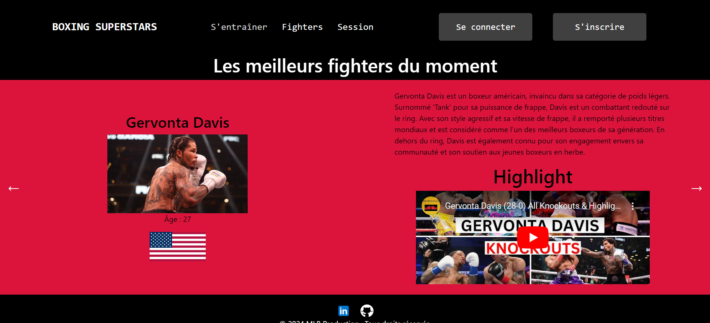

# Boxing Superstars - "Le projet de toute une vie"
## Site Web d'Entraînement pour le Cardio

Ce site web est conçu pour vous permettre de vous entraîner en cardio en pratiquant le "Shadow Boxing" avec différents niveaux de difficulté. Doté d'une interface plaisante, il offre également du contenu sur les meilleurs sportifs du moment, vous permettant de vous inspirer pour vos séances de shadow boxing.

## MCD

## Suivi du projet avec Trello

### Gestion du Projet - 
- Réflexion du site avec le MCD (1j)
- Création de la base et des données dans la bdd mongo (1j)
- Mise en place des bundles manquant pour react // Ajout des ressources audios et icônes (1j)
- HomePage (3j)
  

## Fonctionnalités

- Entraînement en "Shadow Boxing" avec choix de niveau de difficulté.
- Choix de la pratique MMA ou Boxe Anglaise
- Contenu sur les meilleurs sportifs pour inspiration.
- Authentification et connexion avec votre compte utilisateur.
- Suivi des séances d'entraînement effectuées.

## Aperçu
 

## Technologies Utilisées

Ce projet est développé en utilisant les technologies suivantes :

- **React** : pour la partie front-end de l'application.
- **Node.js** : pour la partie back-end de l'application. Dépendance : (express / axios / mongoose)
- **MongoDB** : pour la base de données.
